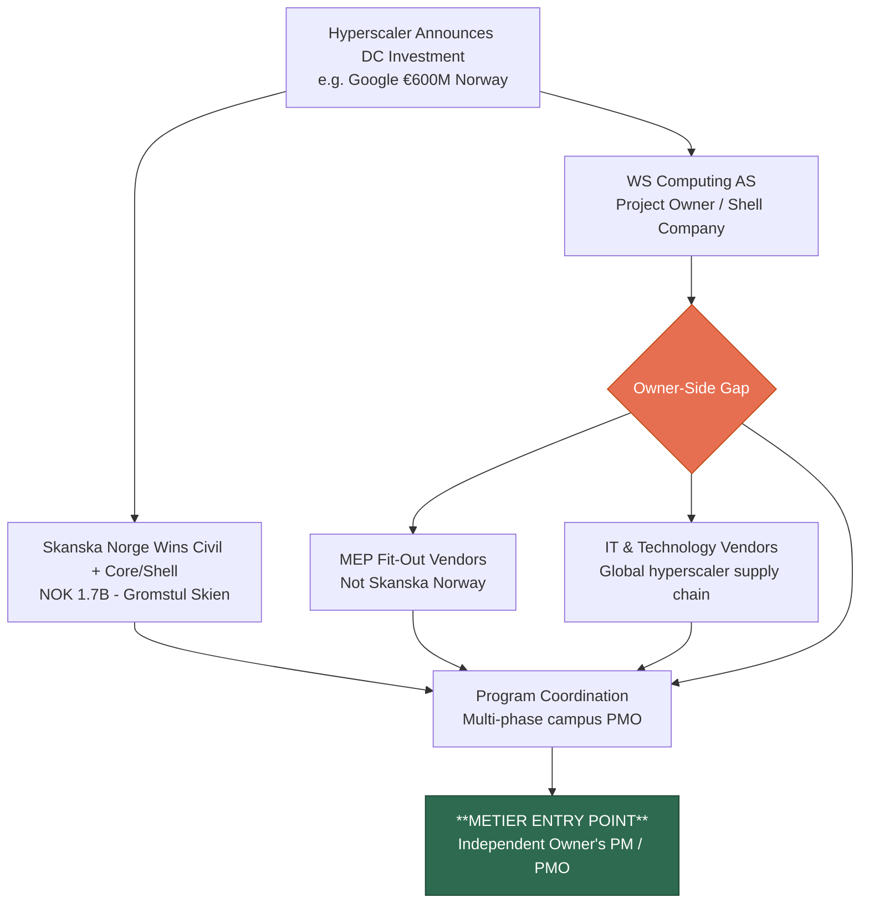

# Skanska: Data Center Research Brief

> Skanska is a construction partner, not a competitor — and the coordination gaps their civil-only Norwegian scope creates are Metier's primary entry point into the hyperscale DC market.

---

## Visual Overview

---

## What / Why / How / When / Who

### WHAT — What Skanska Does in Data Centers

**Globally:** One of the world's top DC construction contractors. 30+ years, 240+ projects, ~150 MW/year delivered. ~$1B+ in DC orders per quarter (Q4 2025: SEK 9.5B). Active in US (dominant), UK (via SRW MEP subsidiary), Norway, and Finland.

**Norway specifically:** Civil groundworks (NOK 1.1B) + core & shell (NOK 569M) for Google/WS Computing's 240 MW hyperscale campus in Skien, Telemark. Norway's first hyperscale DC. **Scope: civil + structural only — no MEP.**

**Delivery models:** Core & shell (Nordics), shell + interior fit-out (US hyperscale), MEP fit-out via SRW (UK), design-build (UK colocation).

---

### WHY — What Drives Skanska into DC

**External:**
- AI-driven hyperscaler capex ($443B 2025 → $602B 2026)
- Hyperscaler announces investment in a market where Skanska has a local entity → trigger to bid
- Norway: Google's €600M announcement → Skanska Norge wins NOK 1.7B

**Internal:**
- Repeat/existing client relationships (CFO: "following our customers")
- SAT division utilization (285+ DC specialists needing deployment)
- Margin discipline: 4.1% operating margin vs. industry 2–3% (selective bidding only)

**Entry pathway always:** Preconstruction services → early works → main award → supplemental contracts. Never speculative.

---

### HOW — How Skanska Expands DC by Country

**3-stage pattern (consistent across all geographies):**
1. Global/repeat client selects Skanska in a new geography
2. Skanska leverages existing local entity + exports SAT expertise via mobile expert groups
3. Repeat and supplemental work follows

| Country | Entry | First DC Contract | Status |
|---|---|---|---|
| **USA** | IBM anchor, ~1993 organic | IBM Southbury; eBay Utah | Dominant: $6B+, 200+ projects |
| **UK** | Kvaerner acquisition (2000) gave SRW MEP | VIRTUS London (pre-2021) | Growing: SRW profitable on DC |
| **Norway** | Google client-pull (2024) | NOK 1.1B groundworks (Feb 2024) | Active: NOK 1.7B committed |
| **Finland** | Unnamed tech client (2025) | EUR 95M core & shell | First project underway |
| **Sweden** | SAT knowledge transfer | SEK 690M + 1B referenced | Emerging; late mover |
| **Germany** | No business unit | None | **Structural gap** |
| **Poland/CEE** | Infrastructure focus | None confirmed | Not yet active |

**No DC acquisitions.** All growth organic and client-led.

---

### WHEN — Key Timing Signals

| Signal | Date | Metier Implication |
|---|---|---|
| Phase 1 groundworks complete | Q4 2025 | Handoff to MEP fit-out underway NOW |
| Phase 2 permit submitted (Building 2, Gromstul) | August 2025 | Phase 2 procurement will start — Metier should be positioned |
| Finland EUR 95M (new DC market entry) | Q3 2025 | Pattern repeating: another Nordic market needing owner-side PM |
| SAT expanded to 285+ specialists | September 2025 | Skanska doubling down on DC; more projects in pipeline |
| Norwegian DC licensing rules (national register) | December 2024 | Regulatory complexity increases for DC owners |
| Nordic DC market CAGR | 23.47% (2024–2030) | More hyperscale programs coming; owner-side PM demand growing |

---

### WHO — Key Players and Relationships

**Skanska Norway:**
- CEO/BU President: Stein Ivar Hellestad
- Subsidiary: Marthinsen & Duvholt (structural steel, jointly executes DC contracts)
- No published dedicated DC team

**Skanska Global DC:**
- EVP SAT: Katie Coulson (25+ years sector experience)
- EVP Skanska Integrated Solutions: Anita Nelson (also oversees SAT)
- CFO Group: Jonas Rickberg ("following our customers" in DC)
- CEO Group: Anders Danielsson (publicly champions DC growth)

**DC Owner (Metier's primary target):**
- WS Computing AS — Google's Norwegian project vehicle; holds real estate + contracts
- Google's global DC construction team — provides oversight but spread across dozens of global programs

**Norwegian subcontractors at Gromstul:**
- Bluegreen Group (PE water pipeline), Telerør Elektro (electrical conduit), Olsen & Wallum, +13 companies total

---

## Gaps & Weaknesses — Top 5 for Metier

| # | Gap | Why It Matters |
|---|---|---|
| 1 | **No MEP capability in Norway** | Owner must coordinate MEP fit-out separately → program management gap |
| 2 | **Single-client concentration** (Google only) | No multi-client DC portfolio in Norway; pipeline risk if Google diversifies |
| 3 | **Not a full turnkey provider in Norway** | Owner coordinates 5+ work streams; needs independent PMO |
| 4 | **No dedicated Norway DC team published** | Local DC competence is new; complex programs need external PM support |
| 5 | **Late mover in Sweden** | Pattern suggests knowledge-transfer model works; same gap will arise in Sweden |

---

## Implications for Metier

### Position: Owner's Side, Not Contractor's Side

Metier is NOT competing with Skanska. Skanska builds structures. Metier manages programs on the owner's behalf. The gap Skanska's civil-only scope creates is precisely Metier's entry point.

### Primary Opportunity: Program PMO for Norwegian Hyperscale DC

The Gromstul program involves civil (Skanska), MEP (others), IT/technology (Google global), commissioning, and regulation — across multiple phases and buildings. Someone must sit above all of this on the owner's behalf and manage the whole program.

**Metier's pitch to WS Computing / Google:** *"We ensure your Norwegian DC program is delivered on time and on budget — managing the interfaces between your civil contractor, MEP vendors, and IT teams, while navigating Norwegian planning and contract law on your behalf."*

### Near-Term Action: Target Phase 2 Procurement Window

Phase 2 at Gromstul is in planning (permit submitted August 2025). The procurement window for Phase 2 program management support will open in the near term. Metier should be in conversation with WS Computing / Google's DC construction team before that window closes.

### Longer-Term: Position for the Next Hyperscale Entrant in Norway

Google is confirmed. Other hyperscalers (Microsoft, Amazon, Meta) are evaluating the Nordics. Each will face the same challenge: a civil contractor who does core/shell, separate MEP vendors, and no in-house Norwegian owner's PM capability. Metier should be the established answer to that challenge before the next entrant arrives.

---

## Sources

All claims sourced in subtask research files (01–07). Key primary sources:
- Skanska Group press releases: [group.skanska.com/media/press-releases-articles](https://group.skanska.com/media/press-releases-articles/)
- Skanska USA Mission Critical: [usa.skanska.com](https://www.usa.skanska.com/what-we-deliver/build/mission-critical--data-centers/)
- Construction Dive CEO interview: [constructiondive.com](https://www.constructiondive.com/news/skanska-ceo-we-are-well-positioned-to-capitalize-on-ai-boom/811636/)
- DLA Piper Norway analysis: [dlapiper.com](https://www.dlapiper.com/en-us/insights/publications/2024/05/construction-of-googles-eur600-million-hyperscale-data-centre-in-norway)
- SAT expansion: [GlobeNewswire](https://www.globenewswire.com/news-release/2025/09/15/3149901/0/en/Skanska-Advanced-Technology-Expands-to-Address-Data-Center-and-Semiconductor-Markets.html)
- BD+C Giants 400 2025: [bdcnetwork.com](https://www.bdcnetwork.com/home/news/55321777/top-data-center-construction-firms-for-2025)
