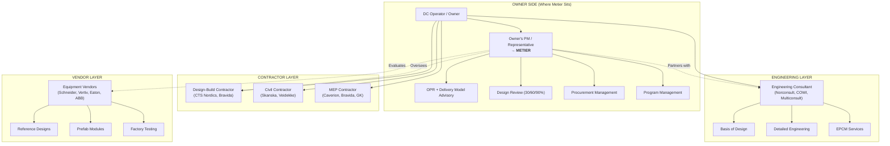
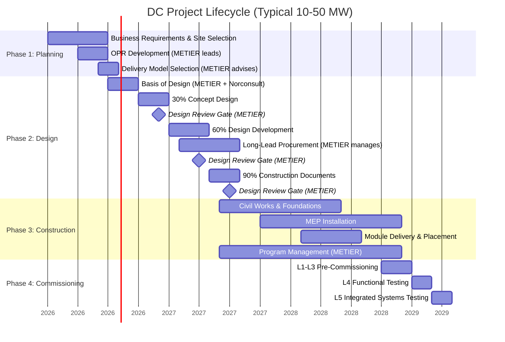
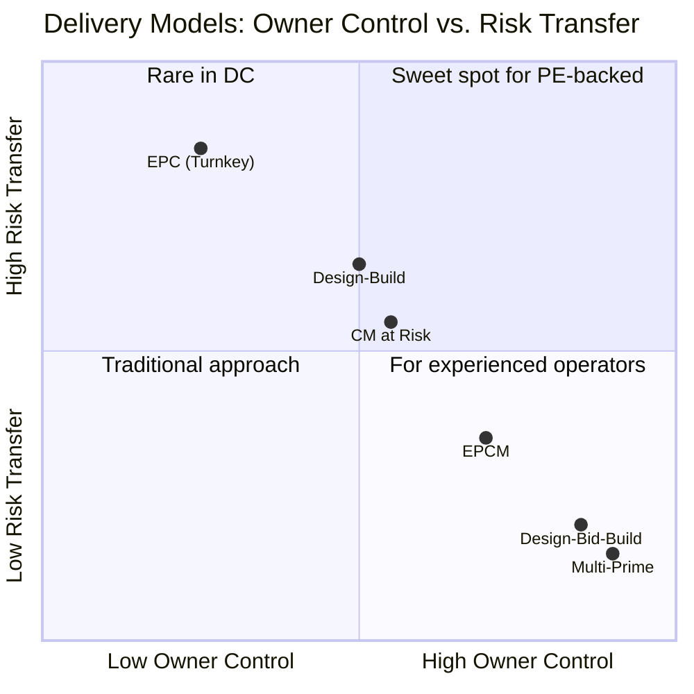
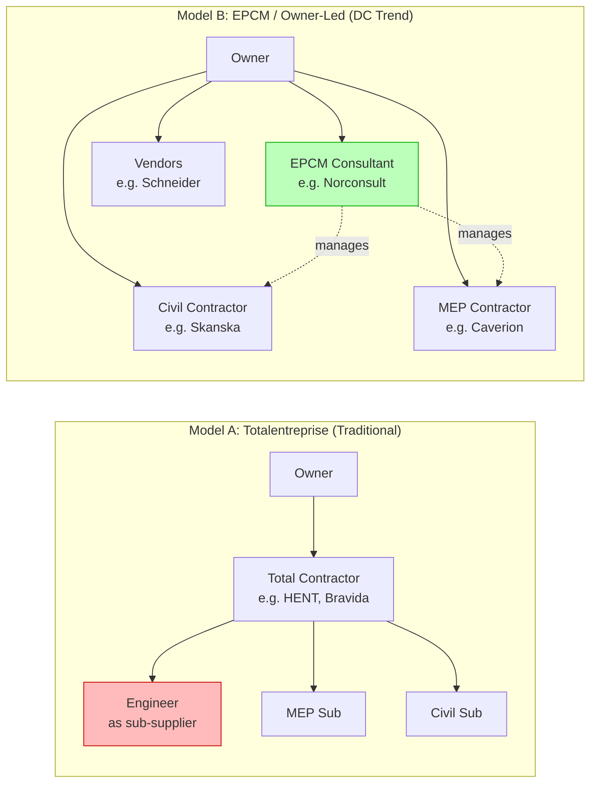

# Data Center Engineering & Design: Research Presentation

> Understanding the DC engineering value chain — standardized designs, basis of design, vendor reference architectures, leverandor relationships, and delivery models — to position Metier's services for Norwegian DC operators.

---

## Visual Overview

### DC Engineering Value Chain & Metier's Position

### DC Project Lifecycle & Metier Entry Points

### Delivery Models Comparison

### Norwegian DC Leverandor Models

---

## What / Why / How / Who / Implications

### What

The data center engineering and design process is a 5-phase lifecycle (Plan → Design → Build → Commission → Operate) where MEP engineering dominates — power and cooling drive the design, accounting for 60-70% of build cost. Unlike conventional buildings, the architect is subordinate to the MEP engineer.

Design progresses through 30/60/90/100% milestones. Equipment lead times (transformers: 16-40 weeks, generators: 20-40 weeks) anchor the schedule. Commissioning is a design discipline planned from day one through 5 levels of testing.

Six delivery models exist (Design-Bid-Build, Design-Build, EPC, EPCM, CM at Risk, IPD), with **Design-Build most common** for large DCs and **EPC growing fast** among PE-backed operators.

### Why It Matters for Metier

The Norwegian DC market is shifting from traditional totalentreprise (where engineers like Norconsult are sub-suppliers to contractors) to **owner-led models** (EPCM, multi-prime) where the engineering consultant works directly for the owner. Both Bulk N01 (Norconsult EPCM) and Skygard (COWI total advisor) demonstrate this trend.

This shift creates demand for independent owner-side project management — exactly what Metier provides. First-time and PE-backed DC developers lack in-house execution capability but need to control critical design parameters that can't be delegated to contractors.

### How Metier Can Engage

**Five service opportunities mapped to project phases:**

| # | Service | Phase | Partners | Revenue |
|---|---|---|---|---|
| A | OPR + Delivery Model Advisory | Planning | Metier only | T&M |
| B | Basis of Design Management | Planning→Design | Norconsult | Fixed fee (1-3% CAPEX) |
| C | Design Review & Management | Design (30/60/90%) | Norconsult support | Monthly retainer |
| D | Procurement & Long-Lead Mgmt | Design→Construction | Metier only | Retainer + success fees |
| E | Multi-Vendor Program Mgmt | Construction→Cx | Metier only | Monthly retainer |

**Critical timing:** Metier must engage **before** the EPCM consultant or Design-Build contractor is selected. Once those are in place, they absorb management scope.

### Who Are the Key Players

**Norwegian DC engineering ecosystem:**

| Player | Role | Relationship to Metier |
|---|---|---|
| **CTS Nordics** | Design-build contractor + NordicEPOD manufacturer | Metier sits opposite — owner's side oversight |
| **Norconsult** | Engineering consultant / EPCM (Bulk N01) | Partner for BoD; complement when design-only |
| **COWI** | Engineering consultant / total advisor (Skygard) | Similar to Norconsult dynamic |
| **Bravida / Caverion** | MEP contractors | Execute under Metier-managed contracts |
| **Skanska / Veidekke** | Civil contractors | Execute under Metier-managed contracts |
| **Schneider / Vertiv / Eaton** | Equipment vendors + reference designs | Metier evaluates and adapts their designs |
| **NS Nordics** | Specialized DC project management | Closest competitor |

### Implications

1. **Metier cannot replicate CTS's standardized design model** — it requires vertical integration (design + manufacturing + construction). But the growth of standardized design-build **increases** demand for independent owner-side advisors.

2. **Metier + Norconsult BoD service is viable and well-precedented** — separately billable, NOK 5-30M per engagement for 10-50 MW projects. Natural entry point that leads to downstream engagement.

3. **Schneider reference designs are starting points, not endpoints** — substantial site-specific engineering remains (civil, grid, TEK17, permitting). Metier manages this gap.

4. **The leverandor dynamic is shifting in Metier's favor** — DC projects are moving from contractor-led (engineer as sub-supplier) to owner-led (engineer works for owner). This creates room for independent PM.

5. **Early phase is Metier's highest-value entry point** — OPR workshops, delivery model advisory, and BoD management happen before contractors are engaged. Once the EPCM firm or DB contractor is in place, PM scope gets absorbed.

6. **NS Nordics is the main competitor** — they're already doing DC project management in Norway. Metier differentiates with broader services (procurement, governance, early-phase advisory) and larger organizational scale.

---

## Sources

Detailed source citations are in the individual research files:

| Subtask | File | Key Sources |
|---|---|---|
| 01 - CTS Standardized Design | `workspace/tasks/01-cts-standardized-design/research.md` | CTS Nordics, Eaton, DCD, Bulk Infrastructure |
| 02 - Basis of Design | `workspace/tasks/02-basis-of-design/research.md` | ASHRAE, SiTESPAN, Norconsult, FIDIC, NS Nordics |
| 03 - Vendor Reference Designs | `workspace/tasks/03-vendor-reference-designs/research.md` | Schneider Electric, Vertiv, Huawei, ABB, ENERCON |
| 04 - Leverandor Relationships | `workspace/tasks/04-leverandor-relationships/research.md` | Standard Norge, Codex, Byggeindustrien, COWI, DLA Piper |
| 05 - DC Design Process | `workspace/tasks/05-dc-design-process/research.md` | DataXConnect, King & Spalding, Procore, Structure Research |
| 06 - Metier Positioning | `workspace/tasks/06-metier-positioning/research.md` | Synthesis of subtasks 01-05 |
| Synthesis | `workspace/synthesis.md` | Cross-subtask synthesis answering 5 original questions |
