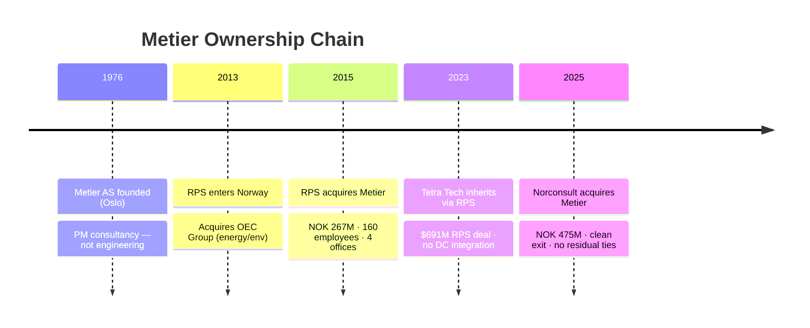
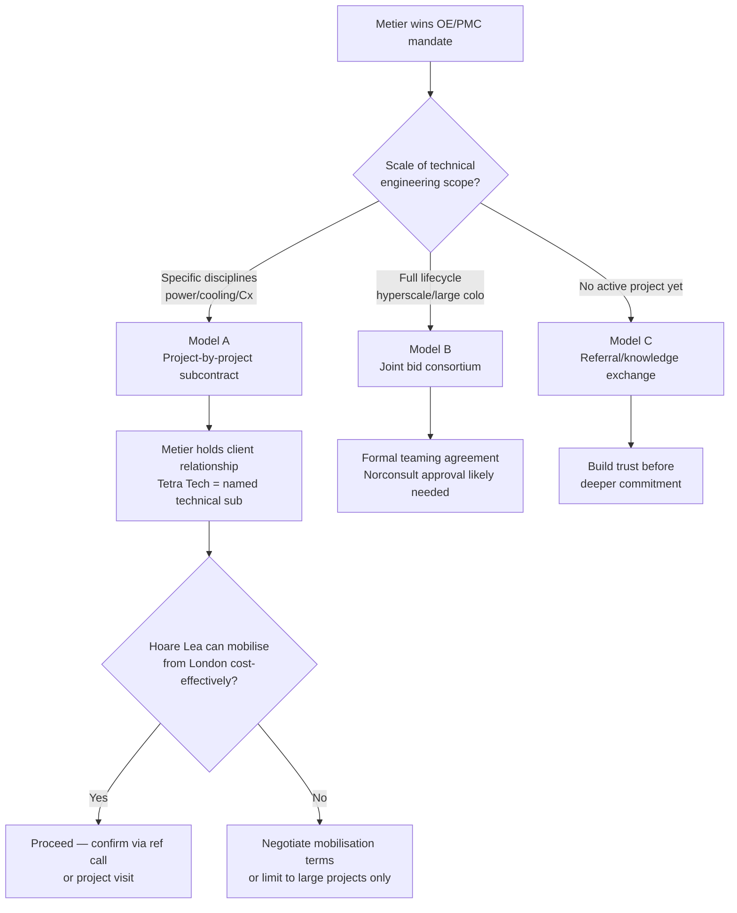

# Tetra Tech — Data Center Capabilities & Alliance Assessment

> Tetra Tech HPBG (Hoare Lea + RPS + GLUMAC + NDY) is a **proven, large-scale DC engineering firm** with named clients including VIRTUS, Global Switch, Telehouse/LINX, China Mobile International, Oracle, IBM, and NTT RagingWire, and active projects at 360MW (Texas) and 600MW (UK); they have zero Nordic DC presence, which makes Metier the essential local partner — the alliance case is now grounded in verified complementarity, not a capability question mark.

> **Updated 2026-04-20** with HPBG CapStat (`02-capstat.md`). Prior finding of "no named DC clients" is **corrected** — references were not on tetratech.com but exist in the HPBG capability statement.

---

## What

- **Tetra Tech is a $5.4B US engineering consultancy** delivering DC services through the **High Performance Buildings Group (HPBG)** — a multi-brand collective including Hoare Lea, GLUMAC, Cosentini, NDY, RPS, and Coffey alongside the core Tetra Tech brand. The HPBG fields 3,500 MEP engineers across 450+ offices.
- **9 DC service areas confirmed by project delivery** — Power & Energy (HV/MV/LV, grid interconnection, gen-sets), Cooling (DTC, oil immersion, hybrid air-water, 100% evaporative), Water Management (WUE/ZLD, greenfield), Sustainability/ESG (BREEAM, PUE 1.1 achieved), Commissioning/IST, Planning & Permitting (UK: multiple named wins), Due Diligence (geotechnical, EIA, brownfield), HV Route Design, and Digital Engineering (CFD).
- **Named clients confirmed via HPBG CapStat:** VIRTUS (London 2/5/7), Global Switch (London), Telehouse/LINX (North Two), China Mobile International (Frankfurt, Tier III Uptime), Oracle, IBM, NTT RagingWire, Kaiser Permanente, UKRI RAL, Infinity Data Centres, Bank of South Pacific.
- **Active projects at hyperscale:** 360MW DTC liquid-cooled campus in Texas (US first of type); 600MW campus in UK (former Ford plant, Lead Consultant, one of Europe's largest); 300MW multi-building campus South East England; 800MW campus The Netherlands (geo-environmental).
- **Uptime Tier III delivery confirmed** across multiple projects (China Mobile Frankfurt, VIRTUS L5/L7, North Two Telehouse, Confidential Reno). Lowest PUE achieved: **1.1** (Reno; UKRI RAL).
- **In Norway and the Nordics, Tetra Tech/HPBG has no DC presence** — confirmed; not a data gap. UK practice is strong; Nordic is a blank slate.

---

## Why

- **The RPS acquisition ($691M, January 2023) was Tetra Tech's European entry** — but the DC practice in Europe runs primarily through **Hoare Lea** (MEP design) and **RPS** (planning/permitting), not the Tetra Tech brand. This is why web searches found no European DC evidence; the work is branded differently.
- **The Metier divestiture (December 2025, NOK 475M) was a PM-vs-engineering split** — Tetra Tech retained the engineering brands (Hoare Lea, RPS) and divested the PM consultancy (Metier). The premium (77% over cost) signals portfolio discipline, not Norwegian market exit.
- **Portfolio rationalisation — not distress — drove the Metier sale** — no non-compete, no preferred supplier arrangement, no ill will. The HPBG CapStat still lists Metier's logo (now struck through), suggesting the relationship is acknowledged.
- **AI-era DC delivery is happening, not just stated** — 360MW DTC liquid-cooled hyperscale (Texas), The Hub (UK's first oil immersion DC at scale), KLON06 (CDU-ready hybrid) confirm that liquid/immersion cooling is delivered, not just published in white papers.
- **Norway's DC engineering gap is real and specific** — no Norwegian firm offers Uptime Tier III MEP design at 25–400MW, DTC/immersion cooling engineering, HV route permitting at grid interconnection scale, or IST-level independent commissioning. HPBG has delivered all of these; Norwegian operators cannot currently source them locally.

---

## How

- **Model A — Project-by-project subcontracting (recommended):** Metier wins the OE/PMC mandate; brings Tetra Tech as a named technical engineering sub-consultant for specific disciplines (power, cooling, Cx, permitting). No exclusivity, no Norconsult approval needed, easy to test on one project before deeper commitment.
  - Best fit: financial investors entering DC for the first time; colocation operators with aggressive timelines needing independent OE + technical MEP design
- **Model B — Joint bid/consortium (selective):** Metier as PMC/OE lead + Tetra Tech as technical engineering lead on full-lifecycle mandates. Combined offer covers feasibility through commissioning; stronger than either firm alone for hyperscale or large colo clients.
  - Requires: formal teaming agreement, likely Norconsult approval for anything exclusive, and confirmed Tetra Tech European DC staffing
- **Model C — Knowledge exchange/referral (entry point):** Informal arrangement — Metier refers clients needing MEP engineering to Tetra Tech; Tetra Tech refers Nordic clients needing OE/PM to Metier. No legal complexity, builds familiarity before deeper commitment.
- **Critical scope boundary in all models:** Metier holds the OE/PMC role and client-facing relationship in every arrangement. Tetra Tech is always a technical sub-consultant — never the client-facing advisor. If Tetra Tech pitches the OE role, it directly competes with Metier's core commercial offering.
- **3 conflict zones need explicit resolution** in any teaming agreement: (1) pre-investment advisory leadership, (2) digital PM tooling (myProjects vs. Metier digital advisory), (3) owner's engineering scope.

---

## When

- **1976–2015 — Metier independent:** 40 years building Norwegian PM advisory brand; no connection to Tetra Tech.
- **April 2015 — RPS acquires Metier** for NOK 267M; positions combined entity as Norway's leading PM organisation.
- **January 2023 — Tetra Tech inherits Metier** through $691M RPS acquisition; 23-month overlap with no DC integration, no joint projects.
- **December 2025 — Clean exit:** Norconsult acquires Metier for NOK 475M; all Tetra Tech–Metier commercial ties severed.
- **April 2026 — Current state:** Tetra Tech/HPBG has no Norwegian DC presence; any Nordic engagement starts from scratch. UK DC pipeline is active and large (360MW Texas, 600MW UK campus, 800MW NL in progress).
- **Now is the right time to engage** — HPBG is actively expanding in European DC; a Metier approach before they establish a competing Norwegian relationship (direct hire or local acquisition) is advantageous. The CapStat confirms they are actively marketing DC services with a full project portfolio.

---

## Who

- **Sam Khalilieh** — National Director, Advanced Manufacturing & Mission Critical; Columbus, Ohio. US MCB practice lead and thought leadership author. Correct first contact for alliance strategy conversations — he controls the DC go-to-market narrative even though European delivery runs through Hoare Lea/RPS.
- **Hoare Lea** — Primary UK MEP delivery vehicle for DC; responsible for VIRTUS ×3, Global Switch, North Two/Telehouse, The Hub, Infinity SDC, KLON06 Phase 4. The operational DC delivery team for any European DC engagement. **Key contact for project-level discussions.**
- **RPS Group** — European planning, permitting, environmental, and HV route delivery vehicle. Confirmed DC work: Bidder Street (77MW planning), Project Saracen (Green Belt release), HV route permitting (5km + 25km). Norwegian residual staff exist post-Metier exit but scope is unclear.
- **GLUMAC** — US West Coast MEP practice; DC clients include Oracle, IBM (multiple), Sun/Oracle. Decades-long IBM relationship.
- **NDY** — APAC MEP practice; IBM Highbrook (Auckland). Not relevant to a Nordic engagement.
- **Tetra Tech RPS Energy Limited** — the legal entity that held Metier; any prior contractual history sits here.
- **Norconsult ASA** — Metier's current parent. Any exclusive or structured Metier–Tetra Tech arrangement requires Norconsult's awareness and, for anything exclusive, approval.
- **Convergence Controls & Engineering** — acquired May 2024; adds verified commissioning/controls/BAS; strengthens the HPBG Cx proposition (US-focused; European extension unclear).

---

## Implications

- **Start the conversation with Sam Khalilieh for strategy; engage Hoare Lea for project delivery** — Khalilieh controls DC go-to-market narrative; Hoare Lea is the actual delivery team for European work. Any teaming agreement needs buy-in from both.
- **Open with the shared ownership history** — Tetra Tech and Metier leadership can reference the 2023–2025 overlap as genuine common ground; this is a rare and natural entry point that most competitors would not have. The HPBG CapStat still lists Metier's logo (now struck through with divestiture), which signals the relationship is acknowledged internally.
- ~~Ask for non-public DC references in the first meeting~~ — **No longer needed.** The HPBG CapStat provides named client references (VIRTUS, Global Switch, Telehouse, China Mobile, Oracle, IBM, NTT RagingWire). Request a project visit or reference call with one of these clients to verify quality and delivery model.
- **The critical question is now operational, not capability** — Tetra Tech's engineering capability is confirmed. The key unknown is: *which HPBG team would staff a Norwegian project, and can they mobilise from London cost-effectively?* Ask Hoare Lea specifically about Nordic project experience and mobilisation model.
- **Metier's negotiating position is stronger than previously assessed** — HPBG's UK pipeline is full (360MW, 600MW, 300MW active). Nordic DC is a new market for them; Metier holds all the access. Negotiate from a position of being the indispensable local partner, not a junior referral arrangement.
- **Assess Norconsult's posture before any exclusive arrangement** — if Norconsult is building MEP engineering capability to compete in DC, a Tetra Tech alliance may create internal political friction. This requires a direct conversation inside Norconsult.
- **The alliance window is time-bounded** — HPBG is actively expanding in European DC. They will eventually enter Norway directly (hire, acquire, or open office). Metier should establish the preferred-partner relationship before that happens.

---

## Sources & Confidence

- **High confidence:** Metier ownership chain (1976–2025); HPBG organisational structure and operating brands (confirmed by CapStat); named client references (VIRTUS, Global Switch, Telehouse, China Mobile, Oracle, IBM, NTT RagingWire — all in CapStat); Nordic DC absence; Metier divestiture terms (NOK 475M, clean exit, no non-compete); UK DC project portfolio at scale (360MW, 600MW, 300MW — stated by Tetra Tech directly in CapStat)
- **Medium confidence:** Sam Khalilieh's role and title (ZoomInfo/RocketReach, not independently verified); which HPBG brand (Hoare Lea vs. RPS) leads a Nordic engagement; alliance viability (complementarity is confirmed; operational staffing model is not); Norconsult's posture toward engineering build-out
- **Low confidence:** European Cx capability depth post-Convergence Controls acquisition; post-divestiture RPS Norway residual staffing; Tetra Tech Delta tooling maturity

---

## Diagrams

- **Ownership Timeline** — `diagrams/01-metier-ownership-timeline.html` (interactive, click events for detail)
- **Alliance Service Map** — `diagrams/02-alliance-service-map.html` (hover/click connections showing 7 alliance angles + 3 conflict zones)

