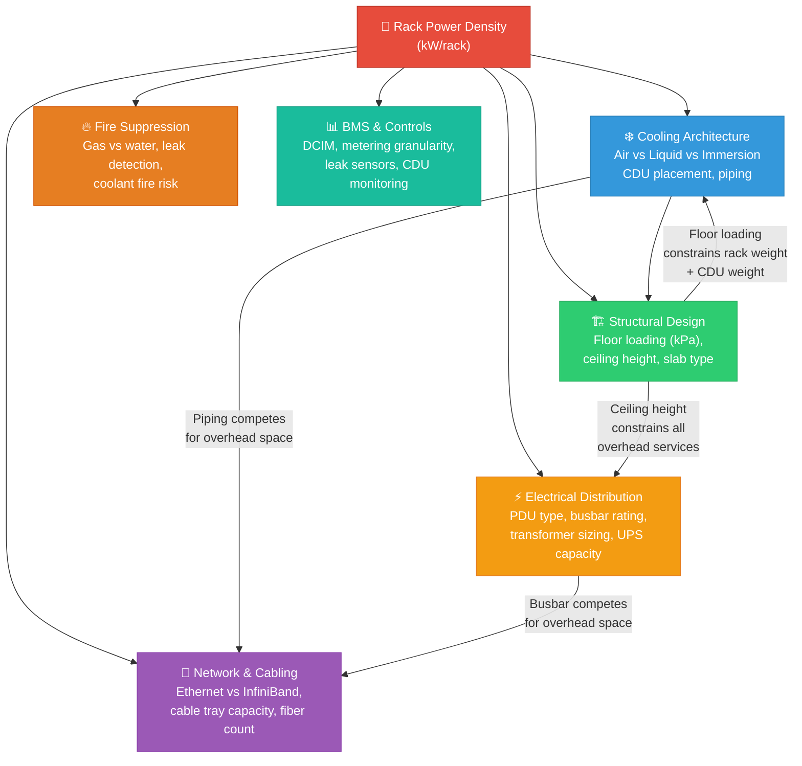
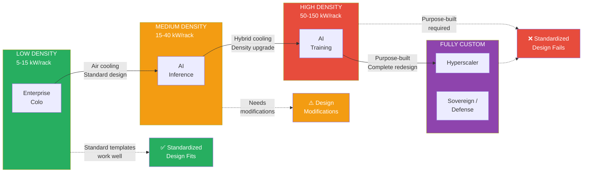
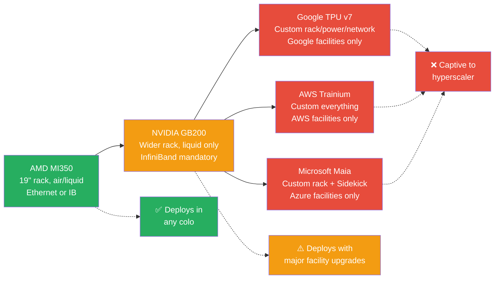

# Research: Data Center Design by End User — What Gets Designed and Why It Changes

> **The single most important insight:** Rack power density is the master variable of data center engineering. Every design parameter — cooling, structural, electrical, network, fire, security — is a downstream consequence of kW/rack. A standard 10 kW/rack facility is a fundamentally different building from a 120 kW/rack AI training facility.

---

## Visual Overview

### Design Domain Cascade — How Power Density Drives Everything

### End-User Archetype Spectrum

### Hardware Portability Spectrum

---

## What — Key Findings

### 8 Engineering Domains Must Be Designed

Every data center requires coordinated engineering across: (1) power architecture & electrical distribution, (2) cooling & thermal management, (3) structural & civil, (4) network & cabling, (5) fire suppression, (6) physical security, (7) BMS/controls, and (8) site & external infrastructure. These are not independent — they cascade.

### Power Density Is the Master Variable

A change in rack density from 10 to 60 kW/rack triggers: 6× transformer capacity, shift from floor PDUs to overhead busbar, transition from air to liquid cooling, 2× floor loading requirements, 1.5× ceiling height, 3–5× cable tray capacity, and different fire suppression risk profiles. These changes happen simultaneously across all disciplines.

### Five Distinct End-User Archetypes Drive Design

| Archetype | Density | Cooling | Key Engineering Driver |
|-----------|---------|---------|----------------------|
| Enterprise Colo | 5–15 kW | Air | Flexibility for diverse tenants |
| AI Inference | 15–40 kW | Air/hybrid | Latency, geographic distribution |
| AI Training | 50–150 kW | Liquid mandatory | Density, InfiniBand fabric, massive power |
| Hyperscaler | Varies | Custom | Proprietary specs, extreme scale |
| Sovereign/Defense | 10–30 kW | Air + TEMPEST | Security, compliance, air-gap |

---

## Why — Root Causes

### Why Standardized Designs Fail

Standard templates assume 8–15 kW/rack air-cooled — the enterprise colo baseline. When an AI training client needs 120 kW/rack with liquid cooling, **every assumption breaks simultaneously**: cooling (air → liquid), power (PDU → busbar), structural (8 kPa → 25 kPa floors), ceiling (3.0m → 5.0m), network (Ethernet → InfiniBand), and potentially compliance (commercial → sovereign).

The 7 specific friction points: cooling mismatch, power distribution topology, floor loading, ceiling height, cabling infrastructure, redundancy level, and compliance requirements.

### Why Hardware Choice Locks Design

NVIDIA GB200 NVL72 mandates: liquid cooling at 25°C/2 L/s, 120 kW power per rack, 1,360 kg rack weight, wider-than-19" chassis, and InfiniBand with 3m copper cable limits. Google TPU v7 goes further: proprietary networking, custom power distribution (±400 VDC), and 9,216-chip pods requiring precise physical arrangement. The more custom the silicon, the more custom the facility.

---

## How — Engineering Implications

### The Cascade at 120 kW/rack (NVIDIA GB200 NVL72)

1. **Electrical:** 4 × 30 kW power shelves per rack, 480V 3-phase. Overhead busbar at 1600A. Dedicated 132 kV substation. 15–20 distribution transformers. Electrical rooms: 2,000–4,000 m².
2. **Cooling:** Mandatory DLC, 25°C coolant inlet, 2 L/s flow rate per rack. CDUs per row. Warm water (45°C return) enables year-round free cooling with dry coolers. PUE: 1.03–1.10.
3. **Structural:** 20–25 kPa floor (reinforced slab, no raised floor). 5.0–5.5m ceiling height. Slab-on-grade mandatory.
4. **Network:** InfiniBand NDR/XDR. Copper DAC <3m (forces rack adjacency). 10,000+ fibers per cluster. Massive overhead cable trays.
5. **Fire:** Gas suppression + leak detection for coolant. Modified risk profile.
6. **Security:** Physical access + ISO 27001 (standard). TEMPEST/blast if sovereign.

### What Cannot Change Post-Construction

- Ceiling height (fundamental building dimension)
- Floor loading (slab thickness and reinforcement)
- TEMPEST shielding (must be built into structure)
- Blast resistance (structural)
- Utility power capacity (requires grid reinforcement, 12–24 month lead time)

---

## When — Timeline and Cost Impacts

- **Standard modular deployment:** 6–12 months
- **Modified design (standard → AI-ready):** 12–18 months (+4–12 weeks re-engineering)
- **Purpose-built AI facility:** 18–24 months
- **Utility grid reinforcement:** 12–24 months (can be the critical path)
- **Large power transformer procurement:** 60–128+ weeks
- **Cost of change during construction:** 5–10× design-stage cost
- **Revenue impact of delay:** ~$14.2M/month per delayed 60 MW facility

---

## Who — Stakeholders

- **End users** (CoreWeave, hyperscalers, sovereign entities) define the specifications
- **DC operators** (CTS, Equinix, Green Mountain) must translate specs to facility design
- **MEP engineers** (Arup, WSP, HDR) design the systems — their first 10 questions to the client determine the entire design direction
- **Structural engineers** set the non-negotiable physical constraints early
- **Equipment vendors** (Schneider, Vertiv, CoolIT, NVIDIA) provide the technology
- **PM/advisory** (Metier) bridges the gap between client specs, engineering design, and construction execution

---

## Implications

### For DC Operators
1. **Choose your segment:** Standard templates work for enterprise colo and inference. AI training and hyperscaler require purpose-built. Trying to serve both with one design fails.
2. **Get density decisions right early:** Cooling architecture, floor loading, and ceiling height are the most expensive parameters to change later.
3. **Build liquid-cooling-ready:** Even if day-1 is air-cooled, design structural and piping infrastructure for future liquid cooling conversion.

### For Metier / Engineering Advisory
1. **The translation gap is the opportunity:** Every major DC deployment involves converting client hardware specs into facility engineering requirements. This is complex, multi-disciplinary coordination.
2. **Early-phase advisory is highest-value:** Getting the 10 key design decisions right before detailed design starts prevents cascading rework.
3. **Nordic advantages are real:** Cold climate (8,000+ free cooling hours/year), hydro power, stable grid, political stability — but the facility must still be designed correctly for the specific workload.

### For the Market
1. **Two-speed market emerging:** (a) Rapid, standardized builds for enterprise/inference, (b) Complex, purpose-built projects for AI training/hyperscaler/sovereign
2. **Hardware evolution drives continuous design change:** NVIDIA Vera Rubin (2026) targets 190–230 kW/rack — today's "AI-ready" designs may be insufficient by next year
3. **The portability spectrum matters:** AMD hardware can deploy anywhere; NVIDIA requires upgrades; Google/AWS/Microsoft are captive. This determines which operators can serve which clients.

---

## Sources

Full source URLs and citations are in individual research files at:
`/research/dc-design-by-end-user/tasks/*/`

Key references: ASHRAE TC 9.9, Uptime Institute Tier Standard, EN 50600, NVIDIA DGX SuperPOD Design Guide, Schneider Electric White Papers, CTS Nordics/Eaton NordicEPOD documentation, Google/Microsoft/AWS infrastructure announcements (2025-2026).
