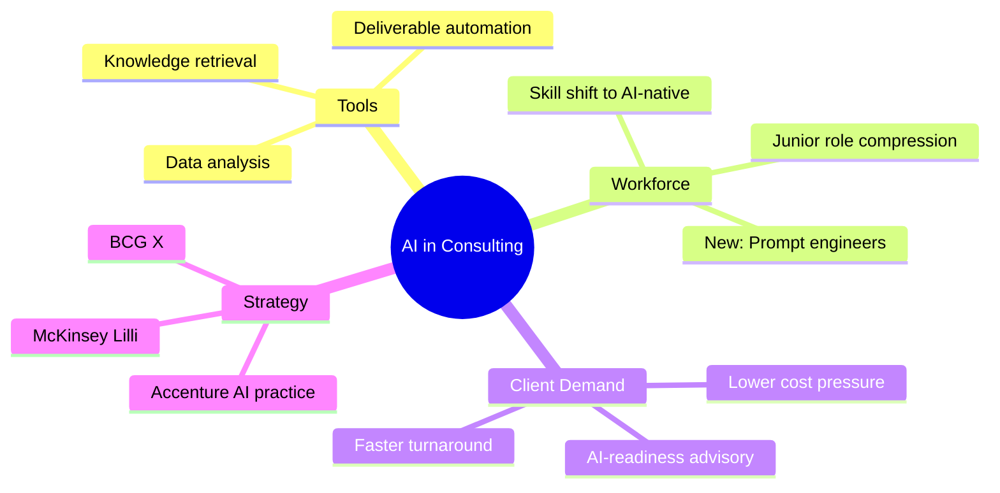

# Spec: Researcher Agent

## Overview
- **Type:** Workflow Skill (Orchestrator)
- **Trigger / Invocation:** `/researcher-agent [scope | file-path | notion-url]`
- **Date:** 2026-03-29
- **Status:** Draft

---

## 1. Functional Spec (What)

### Purpose
`/researcher-agent` is a deep research orchestrator that takes a research scope, breaks it into structured subtasks, generates Socratic prompt chains per subtask, executes the research in parallel where possible, and synthesises the findings into an executive-style visual presentation. It is general-purpose but calibrated toward consulting and business research use cases. It does not write client-facing reports or take actions based on findings — it produces research intelligence only.

### Use Cases
- Deep-dive research on a complex business topic (e.g. "How is AI transforming management consulting?")
- Sector analysis for a consulting engagement (e.g. "Data center market in the Nordics — growth drivers, key players, opportunity")
- Methodology or framework research before designing a new service or process
- Competitive landscape analysis, market sizing, or trend mapping
- Any research task where structured, multi-angle coverage is needed rather than a single search

### Inputs & Arguments
| Input | Type | Required | Description |
|-------|------|----------|-------------|
| `scope` | Free-text inline argument | No | Research scope passed directly, e.g. `/researcher-agent "impact of AI on consulting"` |
| `file-path` | Local `.md` or `.txt` path | No | Path to a file describing the research scope |
| `notion-url` | Notion page URL | No | URL of a Notion page describing the research scope |
| *(none)* | — | No | Agent interviews the user interactively to establish the scope |

### Expected Output
A complete research package saved in two locations:

**Local workspace:** `C:\Users\shelie\.claude\projects\<project-slug>\research\<scope-slug>\`
```
00-scope.md                        # confirmed research scope
01-breakdown.md                    # task breakdown from /breakdown
tasks/
  01-<task-slug>/
    prompt-chain.md                # Socratic prompt chain for this subtask
    prompts/
      01-<prompt-slug>.md          # individual prompt + answer
      02-<prompt-slug>.md
      ...
    research.md                    # merged output of all prompts for this task
  02-<task-slug>/
    ...
synthesis.md                       # cross-task synthesis answering original scope
presentation.md                    # final visual + executive presentation
```

The `<project-slug>` is derived from the matched Metier project name (kebab-case). If no project is matched, the agent asks the user for a folder name and falls back to `C:\Users\shelie\.claude\projects\standalone\research\<scope-slug>\`.

**Notion — Document Library entries in matched project:**
```
Management Consulting
  └─ Metier Projects & Sales (database)
      └─ <Matched Project> (project entry)
          └─ 3. Data & Research
              └─ Document Library: <Project Name> (database)
                  └─ [Research] <Scope Title>         ← synthesis + presentation
                  └─ [Prompt] <prompt-slug> — <task>  ← one entry per prompt executed
                  └─ [Prompt] <prompt-slug> — <task>
                  ...
```

**Per-prompt Document Library entry:**
- `Name`: `[Prompt] <prompt-slug> — <task-slug>`
- `Source`: `Claude`
- Page body:
  ```
  > 📎 Prompt: "<exact prompt text>"   ← callout block
  ---
  <full research answer>
  ```

**Top-level research entry:**
- `Name`: `[Research] <Scope Title>`
- `Source`: `Claude`
- Page body: breakdown summary + synthesis + presentation (all sections)

All other schema fields (project-specific): left blank — user can fill as needed

**Project auto-match logic:**
1. Query the Metier Projects & Sales database (all statuses)
2. Fuzzy-match the research scope keywords against project names
3. If one clear match: confirm with user before proceeding ("Matched to project: **Skygard** — is that right?")
4. If multiple matches or no match: show list and ask user to select, or confirm it's standalone (not linked to a project)

**Final presentation format (presentation.md + Notion page):**

*Part 1 — Visual Summary*
- Executive summary paragraph
- Diagram selected by `/select-diagram` based on content type (Mermaid)
- Supporting diagrams where additional angles benefit from visualisation

*Part 2 — Full Explanation (structured by `/executive-brief`)*
- **What** — definitions, scope, key concepts
- **Why** — drivers, motivations, forces at play
- **How** — mechanisms, methods, processes
- **When** — timing, phases, trajectory (where applicable)
- **Who** — key actors, stakeholders, players (where applicable)
- **Implications** — what this means for the user's context
- **Sources & Confidence** — sources used; flag low-confidence areas

### Edge Cases & Error Handling
- **No input + no conversation context:** Ask the user to describe the scope before proceeding
- **Vague scope (< ~20 words or multi-interpretable):** Ask clarifying questions before calling `/breakdown`
- **Notion URL unreachable:** Fall back to free-text and note the fallback
- **File path not found:** Report the error and ask the user to correct it or describe the scope directly
- **Step fails mid-run:** Stop immediately, report which step failed and what was completed so far, save any completed outputs, and let the user decide whether to retry
- **Notion MCP unavailable:** Save all outputs locally and report which Notion pages could not be created
- **/socrates-prompt-chain fails for a task:** Report the failure, ask the user whether to skip that task or retry before continuing

### Acceptance Criteria
- **Given** I run `/researcher-agent "impact of AI on management consulting"`, **When** the agent completes, **Then** I receive a full workspace at `C:\Users\shelie\.claude\projects\<matched-project-slug>\research\impact-of-ai-on-management-consulting\` and a Document Library entry in the matched project with full research content
- **Given** the agent reaches Stage 2 (breakdown), **When** the breakdown is complete, **Then** the agent pauses and shows me the subtasks — it does not proceed to Stage 3 until I approve
- **Given** a subtask's prompt chain contains independent prompts, **When** Stage 3b runs for that subtask, **Then** those prompts are executed in parallel sub-agents; sequential prompts within a chain run one at a time with cumulative context
- **Given** the agent is processing subtask N, **When** Stage 3a-3c complete, **Then** subtask N is fully researched and saved before subtask N+1 begins
- **Given** a step fails mid-run, **When** the failure occurs, **Then** the agent stops, reports the failure clearly, and saves all completed outputs before halting
- **Given** I run the agent with a Notion URL as input, **When** the agent starts, **Then** it fetches the page content and uses it as the research scope
- **Given** the final presentation is generated, **When** I view it, **Then** it contains at least one Mermaid diagram selected by `/select-diagram`, and the full explanation is structured by `/executive-brief` in executive readable style

---

## 2. Technical Plan (How)

### Architecture & Approach

`/researcher-agent` is an orchestrating skill that sequences 7 stages. The key design principle is **breakdown first, then prompt-chain-per-subtask** — the research scope is decomposed before any prompt chains are generated, and each subtask is fully researched (chain → execute → save) before moving to the next.

```
Stage 1: Scope Resolution & Interview
  → Parse $ARGUMENTS (Notion URL / file path / free text / none)
  → If missing/vague: AskUserQuestion to clarify scope, context, constraints
  → Auto-match scope to a project in Metier Projects & Sales:
      → Query database, fuzzy-match scope keywords to project names
      → Confirm match with user ("Matched to: Skygard — correct?")
      → If no match or user declines: ask for project name or confirm standalone
  → Derive <project-slug> and <scope-slug>
  → Create workspace: C:\Users\shelie\.claude\projects\<project-slug>\research\<scope-slug>\
  → Save confirmed scope to workspace\00-scope.md

Stage 2: Breakdown (via /decompose-task skill)
  → Tell user: "When /decompose-task asks where to save, use: <workspace-path>"
  → Invoke Skill("decompose-task", scope)
  → /decompose-task runs its own interactive interview; user saves to workspace\
  → Rename/move output to 01-breakdown.md in workspace
  → *** CHECKPOINT: show subtasks, ask user to approve before continuing ***

Stage 3: Per-Subtask Research (prompt chain → execute → save, per subtask)
  → For each approved subtask, run the full sequence before starting the next:
    3a. Generate Prompt Chain (via /create-prompts)
      → Invoke Skill("create-prompts", subtask-description)
      → Move/copy output to workspace\tasks\<task-slug>\prompt-chain.md
    3b. Execute Prompt Chain (via /run-prompt-chain)
      → /run-prompt-chain reads chain, classifies each prompt: [independent] | [sequential]
      → Independent prompts → spawn parallel sub-agents, each does deep research (knowledge + WebSearch)
      → Sequential chains → run in order within one agent, each answer builds on prior context
      → Save output to workspace\tasks\<task-slug>\prompts\<nn>-<prompt-slug>.md
      → Merge all prompt outputs into workspace\tasks\<task-slug>\research.md
    3c. Save Prompt Outputs to Notion
      → For each prompt output:
          → Create a Document Library entry in matched Notion project:
              Name: "[Prompt] <prompt-slug> — <task-slug>"
              Source: "Claude"
              Page body:
                > 📎 [callout] Prompt: "<the exact prompt text>"
                ---
                <full research answer>
  → (Sequential across subtasks; each subtask is fully researched before the next begins)

Stage 4: Save Top-Level Research (via /save-research — new skill)
  → All layers already saved locally at each step above
  → Create Document Library entry in matched project:
      → Fetch project page → navigate to "3. Data & Research" → find Document Library database
      → Create new entry: Name = "[Research] <Scope Title>", Source = "Claude"
      → Page body = full research content: breakdown summary, per-task research, synthesis, presentation
        (all in one page, separated by ## sections)

Stage 5: Synthesis (via /synthesise-research — new skill)
  → Read workspace\00-scope.md + all workspace\tasks\*\research.md
  → Synthesise into unified answer to original research question
  → Save to workspace\synthesis.md

Stage 6: Presentation (via /select-diagram + /executive-brief — new skills)
  → /select-diagram reads synthesis.md, selects optimal Mermaid diagram type, generates diagram(s)
  → /executive-brief structures the what/why/how/when/who into executive-readable format
  → Combine into workspace\presentation.md
  → Update Notion Document Library page body with final presentation content

Stage 7: Final Report
  → Display workspace summary and Notion entry counts to user
```

### New Skills to Create
| Skill | Invocation | Purpose |
|-------|-----------|---------|
| `/run-prompt-chain` | `/run-prompt-chain <prompt-chain-file>` | Classifies prompts as independent/sequential, executes them (parallel or sequential), returns research.md |
| `/save-research` | Internal utility | Saves a research layer (content + title + metadata) to local .md + Notion |
| `/synthesise-research` | `/synthesise-research <workspace-dir>` | Reads all task research files + original scope, synthesises into unified answer |
| `/select-diagram` | `/select-diagram <content-file>` | Analyses content, selects optimal Mermaid diagram type, generates the diagram |
| `/executive-brief` | `/executive-brief <content-file>` | Structures content into executive-style format with headings, bullets, scannable layout |

### Updates to Existing Skills
| Skill | Change |
|-------|--------|
| `/socrates-prompt-chain` | Add dependency tagging to each generated prompt: `[independent]` or `[sequential]`. Independent = can be answered without prior context; sequential = builds on preceding answer. Add tagging instructions to the chain generation step. |

### Tools & MCPs Required
- **AskUserQuestion** — scope interview, breakdown approval checkpoint
- **Skill** — invoke /breakdown, /socrates-prompt-chain, /run-prompt-chain, /synthesise-research, /select-diagram, /executive-brief
- **Agent** — spawn parallel research sub-agents for independent prompts
- **WebSearch** — deep research per prompt within /run-prompt-chain
- **Read / Write / Glob** — workspace file management
- **mcp__claude_ai_Notion__notion-fetch** — read Notion scope inputs; navigate to project's Data & Research page
- **mcp__claude_ai_Notion__notion-query-database-view** — query Metier Projects & Sales to find project match; query Document Library to find target data source
- **mcp__claude_ai_Notion__notion-create-pages** — create Document Library entry in matched project

### Files to Create or Modify
| File | Action | Purpose |
|------|--------|---------|
| `~/.claude/commands/researcher-agent.md` | Create | Main orchestrator skill definition |
| `~/.claude/commands/run-prompt-chain.md` | Create | Prompt execution skill |
| `~/.claude/commands/save-research.md` | Create | Save utility skill |
| `~/.claude/commands/synthesise-research.md` | Create | Synthesis skill |
| `~/.claude/commands/select-diagram.md` | Create | Diagram selector skill |
| `~/.claude/commands/executive-brief.md` | Create | Executive structuring skill |
| `~/.claude/commands/socrates-prompt-chain.md` | Modify | Add dependency tagging to prompt chain output |
| `C:\Users\shelie\.claude\projects\<project-slug>\research\<scope-slug>\` | Create (runtime) | Research workspace per run |

### Patterns & Reuse
- Argument parsing (Notion URL / file path / free text / none) — same pattern as `/breakdown` and `/socrates-prompt-chain`
- Save-to-Notion + local file pattern — follows `/spec-out` and `/breakdown`
- Parallel sub-agent spawning — uses Agent tool with `general-purpose` subagent type
- Checkpoint/approval gate — uses `AskUserQuestion` same style as `/breakdown` interview

### Constraints & Non-Goals
- ✅ In scope: research, synthesis, visual presentation, saving all outputs locally and to Notion
- ✅ In scope: updating `/socrates-prompt-chain` to tag prompt dependencies
- ❌ Out of scope: writing client-facing consulting reports or proposals
- ❌ Out of scope: taking actions based on research (sending emails, creating tasks, triggering workflows)
- ❌ Out of scope: modifying source documents or Notion pages passed as input
- ❌ Out of scope: scheduling or running as a background cron job

---

## 3. Task Breakdown

Each task is self-contained and completable in a single agent session.

- [ ] **Task 1:** Update `/socrates-prompt-chain` to tag each generated prompt as `[independent]` or `[sequential]`; also confirm it handles being called twice per research run (once on the full scope, once per subtask) without conflict — *Verify:* Run on a scope, then run again on a subtask from that scope; both produce correctly tagged chains saved to distinct paths — define classification rules in the skill file and add tagging to the output format — *Verify:* Run `/socrates-prompt-chain "data center market"`, confirm each prompt in the output is tagged `[independent]` or `[sequential]`

- [ ] **Task 2:** Write `/run-prompt-chain` skill at `~/.claude/commands/run-prompt-chain.md` — reads a prompt chain file, splits prompts by tag, spawns parallel sub-agents for independent prompts and runs sequential chains in-order, each using knowledge + WebSearch, merges results into a structured `research.md` — *Verify:* Run `/run-prompt-chain ~/.claude/research/test/tasks/t1/prompt-chain.md`, confirm `research.md` is created with all prompts answered

- [ ] **Task 3:** Write `/save-research` skill at `~/.claude/commands/save-research.md` — accepts content, title, workspace path, and Notion parent page ID; saves .md file to workspace and creates Notion subpage — *Verify:* Run it with test content and confirm both the local file and Notion page exist

- [ ] **Task 4:** Write `/synthesise-research` skill at `~/.claude/commands/synthesise-research.md` — reads all `tasks/*/research.md` files + `00-scope.md` from a workspace dir, synthesises into a unified answer, saves `synthesis.md` and Notion "Synthesis" subpage — *Verify:* Run it on a populated workspace dir, confirm synthesis.md addresses the original scope

- [ ] **Task 5:** Write `/select-diagram` skill at `~/.claude/commands/select-diagram.md` — reads content, identifies the dominant structure (timeline, comparison, hierarchy, flow, network, distribution), selects the most appropriate Mermaid diagram type, generates the diagram — *Verify:* Run on synthesis content and confirm the output is a valid, rendered Mermaid diagram

- [ ] **Task 6:** Write `/executive-brief` skill at `~/.claude/commands/executive-brief.md` — reads content and structures it into executive-style format (what/why/how/when/who + implications + sources), applying scannable headings, bullet points, and consulting best practices — *Verify:* Run on synthesis content and confirm the output is clean, structured, and readable at a glance

- [ ] **Task 7:** Write the main `/researcher-agent` orchestrator at `~/.claude/commands/researcher-agent.md` — implements all 7 stages, calling existing and new skills in sequence, including the breakdown checkpoint gate — *Verify:* Run end-to-end with a test scope, confirm workspace is created, breakdown checkpoint fires, all layers are saved, and final presentation appears in both local file and Notion

- [ ] **Task 8:** End-to-end test with a real research scope (e.g. "How is AI transforming the management consulting industry?") — validate that the full workflow completes without errors, parallel prompts execute simultaneously, and the final presentation includes at least one Mermaid diagram and a structured what/why/how/when/who section — *Verify:* Complete workspace at expected path, Notion hierarchy with all subpages, presentation renders correctly in Notion

---

## 4. Examples

### Example Invocation
```
/researcher-agent "How is AI transforming the management consulting industry?"
```
or
```
/researcher-agent https://www.notion.so/My-Research-Brief-abc123
```
or
```
/researcher-agent
```
*(agent asks: "What would you like to research?")*

### Example Breakdown Checkpoint
```
I've broken your research scope into 5 subtasks:

1. AI adoption patterns in management consulting (drivers, pace, barriers)
2. Emerging AI-native consulting tools and platforms
3. Impact on consulting workforce: roles, skills, hiring
4. Client demand shifts: what clients now expect from consultants
5. Strategic responses: how leading firms (McKinsey, BCG, Accenture) are adapting

Does this breakdown look right? Type 'yes' to proceed, or let me know what to add, remove, or change.
```

### Example Final Presentation (presentation.md excerpt)
```markdown
# Research: How AI is Transforming Management Consulting

## At a Glance
AI is restructuring consulting from a labour-intensive advisory model toward a
hybrid model combining human judgment with AI-augmented analysis, knowledge retrieval,
and automated deliverable production. The transformation is already underway at tier-1
firms and accelerating.

## Landscape Overview



## What
Management consulting is integrating AI across the full value chain — from research
and analysis through to client presentation and implementation support...

## Why
- **Cost pressure:** Clients increasingly challenge fees for work that AI can replicate
- **Speed demand:** Boards and executives expect faster insight cycles
- **Competitive differentiation:** First movers gain pricing power and talent advantage

## How
...

## When
- 2022–2024: Experimentation phase — AI tools adopted internally, mostly for research
- 2025–2026: Integration phase — AI embedded in client delivery; new service lines emerge
- 2027+: Structural phase — firm economics change, junior headcount compresses

## Who
- **McKinsey:** Lilli (internal AI platform), 100k users
- **BCG:** BCG X innovation + AI practice scaling
- **Accenture:** Largest AI practice globally by revenue

## Implications
For Metier: The shift creates a window to differentiate on AI-augmented project
intelligence while larger firms focus on internal platform build-out...

## Sources & Confidence
- High confidence: firm-level data from public sources (McKinsey, BCG, Accenture annual reports)
- Medium confidence: workforce impact projections (conflicting estimates across sources)
- Low confidence: client demand shift data (limited public research as of 2026)
```
