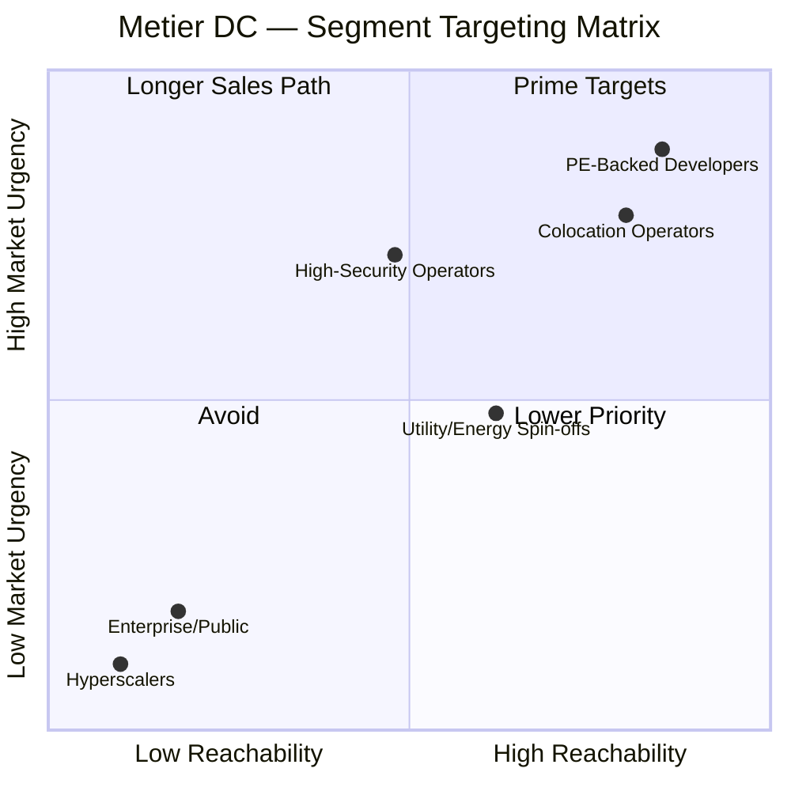
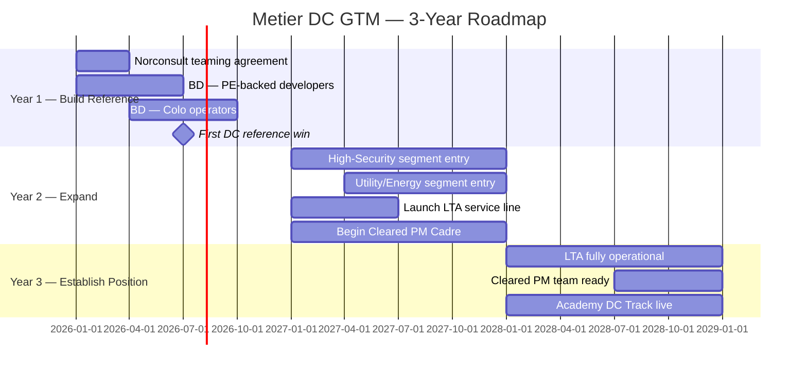

# Metier DC Advisory — GTM Strategy

> Metier has genuine owner-side DC advisory capability across 6 service lines but zero market visibility; the single highest-leverage action is direct outreach to PE-backed DC developers and their sponsors, using the Norconsult teaming agreement as the structural enabler.

**Research scope:** What does Metier do for data centers, what could they do, and which customer groups should they target and why?
**Produced:** 2026-04-19 | **Tasks synthesised:** 5 | **Workspace:** `workspace/datacenter-gtm/metier-dc-services-segments/`

---

## Diagrams

| Diagram | Description | Files |
|---------|-------------|-------|
| Segment Targeting Matrix | Market urgency vs. reachability — which segments to prioritise | [`diagrams/01-segment-targeting-matrix.html`](diagrams/01-segment-targeting-matrix.html) |
| GTM Roadmap 2026–2028 | Three-year go-to-market sequence with initiative timeline | [`diagrams/02-gtm-roadmap.html`](diagrams/02-gtm-roadmap.html) |

### Segment Targeting Matrix (Mermaid)

### GTM Roadmap 2026–2028 (Mermaid)

---

## What

- **Six Tier 1 services map directly to DC operator needs today** — Owner's Engineer/PMC, Project Execution & PM, Contract & Procurement, Portfolio Governance, Early-Phase Advisory/KS, and Uncertainty Analysis. Two services are follow-on (Strategy, Competence Development); one is peripheral (Digital Advisory).
- **The website creates an invisibility problem** — metier.no has no DC framing, no DC case studies, and no DC-specific language. The capability is internally documented and real; the external signal is absent.
- **The Norwegian DC market is structurally undersupplied on owner-side advisory** — no Norwegian PM consultancy has systematically positioned for this segment. COWI has a design conflict (Skygard byggherreombud); Turner & Townsend has no Norwegian footprint; Hill International has no Norwegian PM presence.
- **3 expansion opportunities extend the position over 18–36 months** — Lender's Technical Advisory (~80% existing capability, first-mover in Norway), Cleared PM Cadre (structural moat for high-security segment), Metier Academy DC Track (unclaimed niche in DC-specific PM training).

---

## Why

- **PE-backed DC developers have the highest urgency and fastest buying cycles** — PE capital is time-pressured; every week between close and FID is IRR erosion. Buying decisions take weeks, not months.
- **The pain points are investor-imposed, not operator-discretionary** — PE governance provisions (quarterly milestone reporting, board CAPEX approval thresholds, EU Taxonomy compliance, drawdown validation) create non-negotiable demand for exactly what Metier delivers.
- **Metier's strongest differentiators have no direct Norwegian competitor** — the KS2/Uncertainty Analysis methodology has been applied to NOK 800B+ in Norwegian capital projects. No competitor offers equivalent analytical depth with Norwegian regulatory risk parameterisation.
- **The Norwegian DC pipeline is large and accelerating** — Fossefall (500 MW ambition), Kitebrook (130 MW, Bordalen project), Bulk Infrastructure (1.5 GW), Skygard OSL2 (follows NOK 2.4B OSL1) are all active. Power availability, NATO alignment, and sovereign cloud requirements are structural demand drivers.
- **Metier lacks DC engineering capability** — cooling topology design, HV/grid connection engineering, fire protection, and uavhengig kontroll cannot be delivered without a partner. This structural gap blocks independent pitching on full-scope DC engagements.

---

## How

- **Enter via PE sponsor channel, not cold operator outreach** — PE sponsors (Infranode, TVM Capital, Ferd) are sophisticated buyers who understand independent advisory and can mandate it as an investment condition. This channel is 3–5x more efficient than cold outreach to operators.
- **Lead with 3 scoped entry services** — Owner's Engineer (from EPC contract award), Contract & Procurement (pre-tender packaging), and Uncertainty Analysis (at FID). These are bounded, high-stakes, near-term — the fastest buying decisions.
- **Activate Metier + Norconsult teaming agreement before the first major pitch** — Metier as prime (PM/OE/governance/procurement), Norconsult as named sub (MEP engineering, grid connection, fire protection, uavhengig kontroll). Pre-agreed scope allocation matrix + exclusivity clauses.
- **Deploy 4 follow-on services after trust is established** — Portfolio Governance (recurring mandate for multi-site operators), Early-Phase Advisory (utility spin-offs), Strategy Advisory (Pattern C only), Competence Development (after PMO engagement).
- **Expand via 3 initiatives over 18–36 months:**
  - *LTA (immediate):* 1 senior hire with lender-side construction monitoring experience; legal partnership for covenant advisory (Wikborg Rein or BAHR); 3–6 months to launch
  - *Cleared PM Cadre (12–18 months):* 3–5 PMs with personal sikkerhetsklarering; apply now for 6+ month processing timeline
  - *Academy DC Track (Year 3):* 2–3 DC-specific modules; 1–2 SMEs with DC PM track records

---

## When

- **Q1 2026 — Activate infrastructure:** Sign Norconsult teaming agreement; identify and brief PE sponsors active in Norwegian DC
- **Q1–Q2 2026 — BD: PE-backed developers:** Pre-tender contract strategy for Fossefall, Kitebrook, Bifrost Edge; UA at FID for any in-flight fundraise
- **Q2–Q3 2026 — BD: Colo operators:** OE/PMC proposals for Bulk, Green Mountain, Stack/DigiPlex; portfolio governance pitch for multi-site operators
- **H2 2026 — First DC reference win:** Target at minimum one signed engagement — this reference unlocks all subsequent market entry
- **2027 — Expand to Segments 3+4:** High-security entry (Skygard OSL2 contract strategy); utility/energy entry via existing energy relationships; launch LTA service line; begin Cleared PM Cadre applications
- **2028+ — Establish position:** LTA fully operational; Cleared PM team delivering; Metier Academy DC Track live; Norway's leading owner-side DC advisory firm

---

## Who

**Primary targets — Year 1:**

| Company | Archetype | Signal | First Pitch |
|---------|-----------|--------|-------------|
| Fossefall | PE-backed, Pattern A | 500 MW ambition, SPV structure | UA at FID + OE scope |
| Kitebrook | PE-backed, Pattern A | 130 MW pipeline, ~1–4 staff | Contract strategy advisory |
| Bifrost Edge | PE-backed + utility | DC + waste heat concept | Early-Phase Advisory |
| Bulk Infrastructure | Colo, Pattern D | 1.5 GW ambition, multi-site | Portfolio Governance + Procurement |

**Primary targets — Year 2:**

| Company | Archetype | Signal | First Pitch |
|---------|-----------|--------|-------------|
| Skygard | High-security, Pattern B | OSL2 likely following OSL1 | Cleared-scope contract strategy |
| Eidsiva Lighthavn | Utility spin-off, Pattern C | Gjøvik + Rudshøgda sites active | Pre-FID concept advisory |

- **Entry channel** — PE sponsors active in Norwegian DC: Infranode, TVM Capital, Ferd, institutional infrastructure funds. Approach sponsors first; they can mandate Metier as an investment condition.
- **Engineering partner** — Norconsult covers all structural gaps (MEP, grid, fire, uavhengig kontroll); Metier as prime.
- **Competitive displacement** — COWI (design conflict on owner-side work), Turner & Townsend (no Norwegian footprint), Hill International (no Norwegian PM capability).

---

## Implications

- **GTM cannot rely on inbound or SEO** — the website gap means zero DC operators will find Metier organically. All Year 1 pipeline must come from direct outreach and PE sponsor relationships.
- **Pitch a scoped problem, not a service portfolio** — "How you split your contracts determines your risk exposure" outperforms "Metier offers 8 DC advisory services." DC operators in execution mode do not buy advisory engagements; they buy solutions to specific, near-term crises.
- **The first Norwegian DC reference is the unlock** — the Norwegian DC community is small; one strong reference transfers rapidly across peers. Winning the first engagement — even at reduced scope — is worth prioritising over margin optimisation.
- **Do not pitch Strategy Advisory as an entry point** — signals long sales cycles and low urgency. Use only with utility spin-offs (Pattern C) pre-FID. For all other segments, strategy is a follow-on.
- **LTA is the highest-value expansion with the lowest barrier** — ~80% of required capability already exists at Metier. The gap is a structured drawdown process and a project finance legal partner. No Norwegian firm has built this — first-mover advantage is available now.
- **The Cleared PM Cadre must start now to be ready in Year 2** — sikkerhetsklarering processing takes 6+ months per person. Waiting until a Pattern B client appears means missing the window.
- **Norconsult exclusivity is non-negotiable** — without exclusivity, the teaming agreement accelerates Norconsult's DC market entry without locking in Metier's position. Exclusivity clause is the most important single term in the agreement.

---

## Sources & Confidence

- **High confidence:** Metier service capabilities and DC applicability (internal dc_services_metier.md, dc_services_metier_pain_point.md); operator archetype profiles and buying behaviour; competitive landscape (COWI, T&T, Hill)
- **Medium confidence:** Named operator pipeline status (Fossefall 500 MW, Kitebrook 130 MW, Bulk 1.5 GW — from public announcements, not confirmed by direct contact); PE sponsor identity; Norconsult's current DC advisory intentions
- **Low confidence:** Revenue potential estimates (NOK 5–20M for PE-backed; NOK 10–30M for high-security — derived from scope assumptions, not market data); Norwegian DC advisory market sizing; buyer psychology (inferred from capital project advisory norms, not primary interviews)

---

*Research tasks: 01-metier-service-portfolio · 02-services-to-dc-needs · 03-dc-operator-profiles · 04-expansion-opportunities · 05-target-segments*
*Full synthesis: [`synthesis.md`](synthesis.md)*
