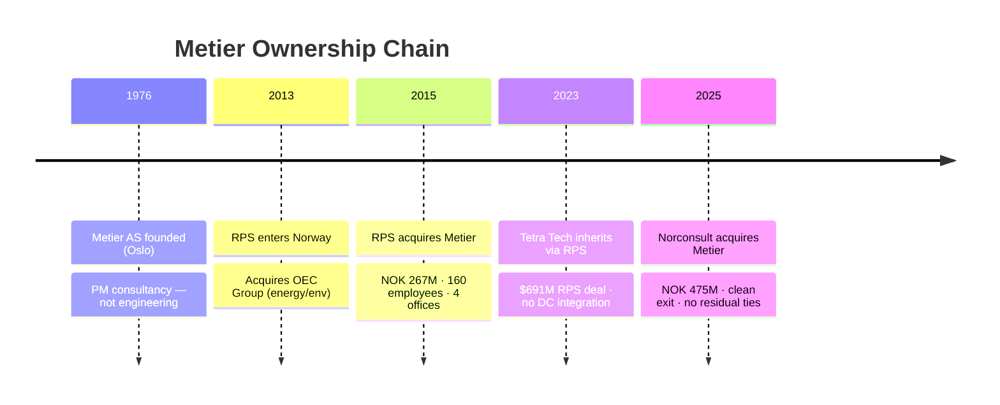
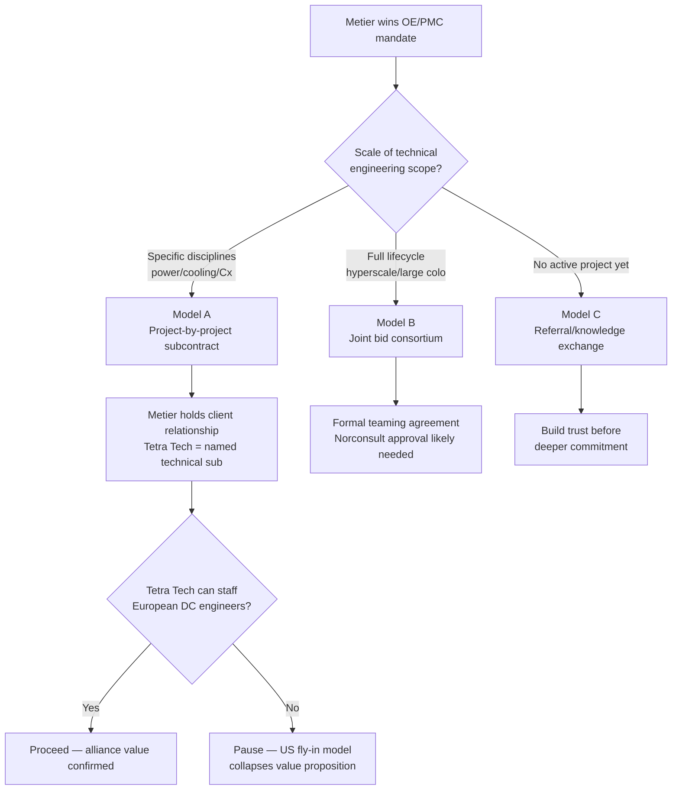

# Tetra Tech — Data Center Capabilities & Alliance Assessment

> Tetra Tech has genuine but unverified DC engineering depth globally, zero Nordic DC presence, and a historical connection to Metier that creates a conversation opener — not a commercial advantage; a Metier-led alliance with Tetra Tech as technical sub-consultant is viable but hinges on confirming that Tetra Tech can actually staff European DC projects.

---

## What

- **Tetra Tech is a $5.4B US engineering consultancy** with a DC practice branded as Mission Critical Buildings (MCB), sitting within the High Performance Buildings solution area of the Commercial/International Services Group (CIG).
- **8 DC service lines are publicly claimed** — Power & Energy Engineering (strongest evidence), Water Management (primary global identity), Sustainability/ESG, Commissioning/IST, Cooling Engineering (including DTC/liquid cooling for AI), Planning & Permitting via RPS Europe, Feasibility/Due Diligence, and Digital Engineering (CFD, digital twins).
- **The MCB practice is a sector overlay, not a standalone BU** — a small expert nucleus (led by Sam Khalilieh, Columbus, Ohio) coordinates delivery across shared CIG engineering staff; no dedicated DC P&L has been identified.
- **No named DC clients, no MW-scale portfolio, and no Uptime Institute or BICSI credentials** are publicly available anywhere in the world — a significant credibility gap vs. specialist DC firms such as DLR Group, Corgan, and Syska Hennessy.
- **In Norway and the Nordics, Tetra Tech has no identifiable DC presence** — confirmed across 7 independent research angles; not a data gap.

---

## Why

- **The RPS acquisition ($691M, January 2023) was Tetra Tech's European entry** — it brought ~5,000 staff across UK/Europe/APAC, with DC listed as a named property sector. But RPS's Norwegian operations (built via OEC Group in 2013 and Metier in 2015) were concentrated in O&G project management and environmental consulting, not mission-critical engineering.
- **The Metier divestiture (December 2025, NOK 475M) removed Tetra Tech's only client-facing Norwegian asset** — Metier's 250 employees and NOK 494M in revenue represented the deepest Norwegian relationship in the Tetra Tech group; selling it ended that.
- **Portfolio rationalisation — not distress — drove the Metier sale** — the NOK 475M exit price represents a 77% premium over the NOK 267M RPS paid in 2015; no non-compete, no preferred supplier arrangement, no ill will.
- **AI-era data centers are Tetra Tech's stated growth focus** — 3 white papers published 2024–2025 specifically on liquid cooling, direct-to-chip (DTC) cooling, and CFD modeling for AI DCs signal deliberate positioning in the high-density compute segment.
- **Norway's DC market gap is real** — no Norwegian engineering firm currently offers MEP depth for AI-era DC (liquid cooling, grid interconnection studies, water treatment, IST-level commissioning) at the scale Tetra Tech claims globally.

---

## How

- **Model A — Project-by-project subcontracting (recommended):** Metier wins the OE/PMC mandate; brings Tetra Tech as a named technical engineering sub-consultant for specific disciplines (power, cooling, Cx, permitting). No exclusivity, no Norconsult approval needed, easy to test on one project before deeper commitment.
  - Best fit: financial investors entering DC for the first time; colocation operators with aggressive timelines needing independent OE + technical MEP design
- **Model B — Joint bid/consortium (selective):** Metier as PMC/OE lead + Tetra Tech as technical engineering lead on full-lifecycle mandates. Combined offer covers feasibility through commissioning; stronger than either firm alone for hyperscale or large colo clients.
  - Requires: formal teaming agreement, likely Norconsult approval for anything exclusive, and confirmed Tetra Tech European DC staffing
- **Model C — Knowledge exchange/referral (entry point):** Informal arrangement — Metier refers clients needing MEP engineering to Tetra Tech; Tetra Tech refers Nordic clients needing OE/PM to Metier. No legal complexity, builds familiarity before deeper commitment.
- **Critical scope boundary in all models:** Metier holds the OE/PMC role and client-facing relationship in every arrangement. Tetra Tech is always a technical sub-consultant — never the client-facing advisor. If Tetra Tech pitches the OE role, it directly competes with Metier's core commercial offering.
- **3 conflict zones need explicit resolution** in any teaming agreement: (1) pre-investment advisory leadership, (2) digital PM tooling (myProjects vs. Metier digital advisory), (3) owner's engineering scope.

---

## When

- **1976–2015 — Metier independent:** 40 years building Norwegian PM advisory brand; no connection to Tetra Tech.
- **April 2015 — RPS acquires Metier** for NOK 267M; positions combined entity as Norway's leading PM organisation.
- **January 2023 — Tetra Tech inherits Metier** through $691M RPS acquisition; 23-month overlap with no DC integration, no joint projects.
- **December 2025 — Clean exit:** Norconsult acquires Metier for NOK 475M; all Tetra Tech–Metier commercial ties severed.
- **April 2026 — Current state:** Tetra Tech has no Norwegian DC presence; any Nordic engagement starts from scratch.
- **Now is the right time to engage** — Tetra Tech has publicly signalled AI DC ambitions; their European DC pipeline is unproven; a Metier approach before they establish a competing Norwegian relationship is advantageous.

---

## Who

- **Sam Khalilieh** — National Director, Advanced Manufacturing & Mission Critical; Managing Director, MCB; Columbus, Ohio. The public face of Tetra Tech's DC practice; named author on DC white papers; correct first contact for any alliance conversation.
- **RPS Group** — Tetra Tech's European delivery vehicle (~5,000 staff); UK-based with offices in Netherlands and Ireland; property/DC advisory listed but no DC specialist team identified. Likely staffing vehicle for any European DC delivery.
- **Tetra Tech RPS Energy Limited** — the legal entity that held Metier and sold it to Norconsult; the entity any prior Tetra Tech–Metier contractual history would sit under.
- **Norconsult ASA** — Metier's current parent; Norwegian engineering firm for which PM advisory is a natural complement. Any exclusive or structured commercial arrangement between Metier and Tetra Tech requires Norconsult's awareness and, for anything exclusive, approval.
- **Convergence Controls & Engineering** — acquired by Tetra Tech May 2024; adds verified commissioning, controls, and building systems integration; the most credible proof of DC operational capability in the Tetra Tech portfolio.

---

## Implications

- **Start the conversation with Sam Khalilieh, not RPS UK** — the MCB practice controls DC strategy; RPS UK is the delivery vehicle, not the decision-maker on alliance terms.
- **Open with the shared ownership history** — Tetra Tech and Metier leadership can reference the 2023–2025 overlap as genuine common ground; this is a rare and natural entry point that most competitors would not have.
- **Ask for non-public DC references in the first meeting** — the absence of any public project evidence is the single biggest unknown. Before committing to any alliance model, Metier needs 2–3 European DC project references (MW scale, client type, scope) to validate that Tetra Tech's capability is real, not just thought leadership.
- **Confirm European DC staffing before any project commitment** — the critical unanswered question is whether Tetra Tech can staff a Norwegian project with engineers who have European DC experience. If the answer is "fly-in from the US," the alliance value proposition collapses on schedule and cost.
- **Assess Norconsult's posture before Model B or C** — if Norconsult is building its own engineering practice to compete in DC, a Tetra Tech alliance may create internal political friction. This requires a direct conversation inside Norconsult, not public research.
- **Tetra Tech's global DC positioning vs. its European DC reality is a negotiating advantage for Metier** — they need Metier's Norwegian market access more than Metier needs their brand. Negotiate from that position.
- **The alliance window is time-bounded** — if Tetra Tech is serious about the Nordic DC market, they will eventually hire locally or acquire a Norwegian engineering firm. Metier should engage before that happens, not after.

---

## Sources & Confidence

- **High confidence:** Metier ownership chain (1976–2025); Tetra Tech corporate/segment structure (GSG/CIG/MCB); Nordic DC absence; Metier divestiture terms (NOK 475M, clean exit, no non-compete)
- **Medium confidence:** Tetra Tech's 8 DC service lines (service catalog well-evidenced; delivery at scale unconfirmed); Sam Khalilieh's role and title (ZoomInfo/RocketReach, not independently verified); alliance complementarity analysis (grounded in public service catalogs; viability depends on European staffing depth)
- **Low confidence:** Tetra Tech's actual DC project portfolio (plausibly classified US federal work; 0 public references); Tetra Tech Delta tooling maturity; post-divestiture RPS Norway staffing and capability; Norconsult's strategic intent toward engineering build-out

---

## Diagrams

- **Ownership Timeline** — `diagrams/01-metier-ownership-timeline.html` (interactive, click events for detail)
- **Alliance Service Map** — `diagrams/02-alliance-service-map.html` (hover/click connections showing 7 alliance angles + 3 conflict zones)

